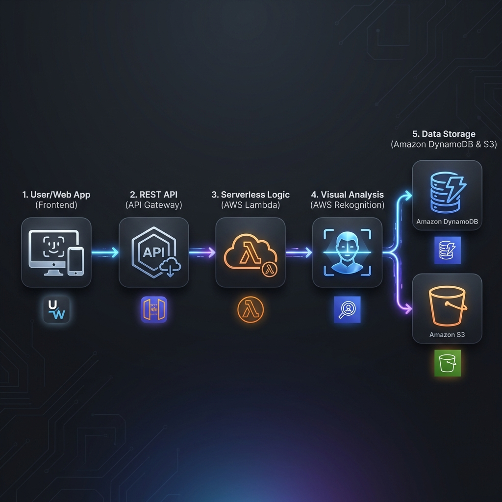
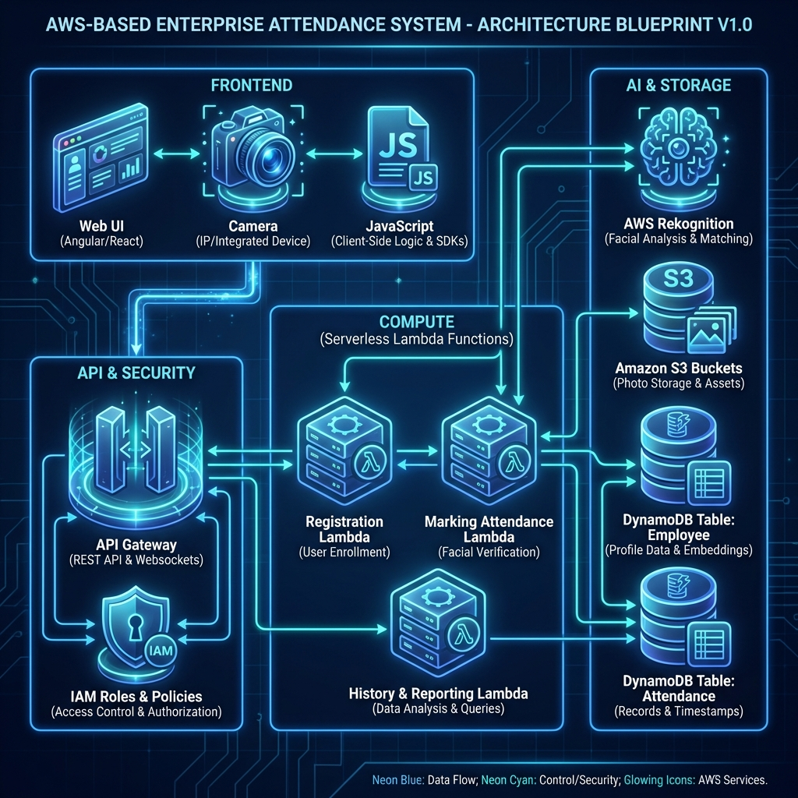

# Face Attendance System Workflow

## System Architecture

## Overview
This project is an automated Face Attendance System powered by AWS. It leverages serverless architecture to provide a seamless experience for both employees and administrators.

## Project Structure

### 📁 Frontend
Contains the user-facing web application.
*   `index.html`: The main dashboard UI.
*   `app.js`: Logic for handling camera capture, S3 uploads, and data fetching.
*   `style.css`: Modern, responsive styling.

### 📁 Backend
Contains the AWS configuration and serverless logic.
*   `LamdaFunction.md`: Python code for all 4 core functions (`markAttendance`, `getRecentAttendance`, etc.).
*   `S3 Bucket.md`: Policies for employee and visitor buckets.
*   `API Gateway.md`: REST API endpoint structure.
*   `AWS Rekognition.md`: CLI commands for managing the face collection.
*   `IAM.md`: Required permissions for the Lambda execution role.

---

## The Workflow

1.  **Registration**: Admin uploads employee photos to the `face-attendance-employees` bucket and runs the `registerEmployees` Lambda to index faces into AWS Rekognition.
2.  **Check-in**:
    *   The user captures a photo via the **Frontend** (`app.js`).
    *   A pre-signed URL is requested (`getUploadUrl`) and the image is uploaded to S3.
3.  **Face Matching**:
    *   The `markAttendance` Lambda is triggered.
    *   It uses **AWS Rekognition** to search for a match in the `employee` collection.
4.  **Logging**:
    *   If a match is found (>80% similarity), the record is saved to **DynamoDB**.
5.  **View Records**:
    *   The Frontend fetches the latest attendance history via the `getRecentAttendance` Lambda endpoint.
